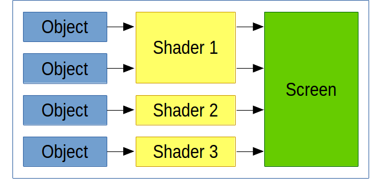
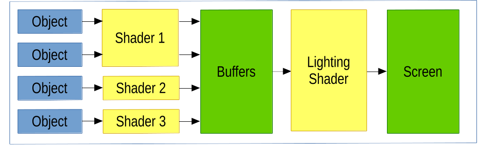

Render Pipelines
================

Foreword
--------

Working with render pipelines can be complicated. As such it is the job of the
engine to make that complication go away. If you are not interested in the
behind-the-scenes information about render pipelines, skip to the last section
to find out why you don't need to know about them.

Overview
--------

To display anything on the screen, it must go through a render pipeline. Dent
affords a large degree of control over this pipeline to the programmer, while
simultaniously making "standard" pipelines quick to set up.

The two main render strategies are deferred rendering and forward rendering, and
we will use these as examples, although other, more complicated strategies are
possible.  This is not a complete guide.  For a more complete story see `here <https://gamedevelopment.tutsplus.com/articles/forward-rendering-vs-deferred-rendering--gamedev-12342>`_.

Forward rendering is the simpler to think about and is probably better
for starting out. In this model, geometry is drawn directly to the screen.

Note that each object is fully drawn one at a time. There may be different
shaders for different objects (eg different lighting effects for water or for
glass), and multiple objects may be drawn by the same shader.

In deferred rendering, the output is post processed after everything has been
drawn. Then a shader is applied to the entire scene simultaniously.

The buffers are diffuse, normal and position maps of the entire scene, and the
first shaders are responsible for populating those maps.

A set of such buffers is a :class:`~dent.RenderStage.RenderStage` and the whole
pipeline is managed by a :class:`~dent.RenderPipeline.RenderPipeline` object.
A pipeline has a number of stages, typically culminating in the screen buffer.
When :attr:`~dent.RenderPipeline.RenderPipeline.run`, it will load each of the
stages in sequence and execute some drawing code for each.

Thus in our direct rendering above, we might have a render pipeline::

  RenderPipeline(
    [
      RenderStage(render_func=display_function, final_stage=True)
    ]
  )

While in the deferred rendering, we might have::

  RenderPipeline(
    [
      RenderStage(render_func=display_function, aux_buffer=True),
      RenderStage(render_func=lighting_function, final_stage=True)
    ]
  )

All of the calls to `glDraw*` happen in the `display_function` and the
`lighting_function`. However, these too will be abstracted away by dent so that,
for example, the lighting display function might just be::

  def lighting_function():
    lightingRectangle.display()

where the lighting rectangle abstracts away the geometry and shader needed to do
the per fragment lighting calculations.

Render pipelines are very simple (take a look at the source code) and as such,
can be made to be very powerful. The can have multiple stages for multiple
lighting/postprocessing passes or render to textures to be used elsewhere in the
game.

Pipelines in Scenes
-------------------

A Dent :class:`~dent.Scene.Scene` has one render pipeline to render the scene to
the display. To help set this up (although you are welcome to do it manually),
the standard scene comes default with a :code:`renderPipeline` attribute set up as per
the first example above. The display function for this pipeline is the :code:`display`
function of the scene. Thus, sufficient bootstrap code is::

  class MainScene(Scene):
    def __init__(self):
      super(MainScene, self).__init__()
      # Make objects here

    def display(self, **kwargs):
      for object in self.objects:
        object.display()

For a deferred rendering scene, extend :class:`~dent.Scene.DeferredRenderScene`.
Again, the display function is :code:`display`.
