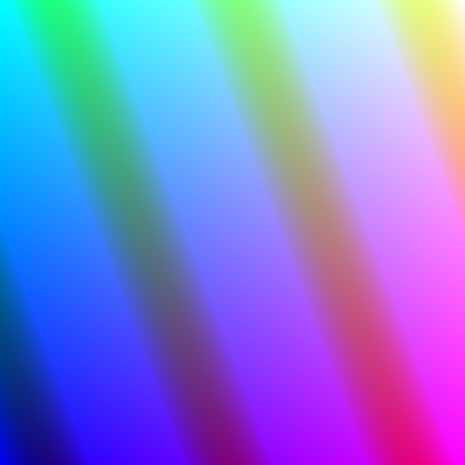

Tutorial: A Shadertoy-like Program
==================================

`Shadertoy <https://www.shadertoy.com/>`_ is a website dedicated to shader-only
programs. It is well worth checking out what you can do with just a fragment shader.

Let us write a fragment shader viewer in Dent. We'll go about it in four short
stages.

Stage 1: Getting a Game Running
-------------------------------

We can use the dent script `dent-init` to set up our game. Simply run::

  $ dent-init tutorial

in order to make a minimal game tree.

Lets take a look at what's been added. We now see a directory called :tutorial:
under which all our code and assets etc will go.

The entrypoint to our game (ie the file we'll run) is called ``tutorial``. We
don't need to do any setup before the game runs, so this file just has a single
import statement. Dent is unusual (underdeveloped) in that the game begins when
you import that module. This is earmarked to be changed in the near future.

Every game needs a scene, and we have a dummy one, ``scenes/MainScene.py``::

  from dent.Scene import Scene

  class MainScene(Scene):
    pass

The file ``scenes/__init__.py`` does some python and dent housekeeping. It is
unimportant at the moment

Running the `tutorial` file should present you with a blank scene. Mmmm.
Progress!

Stage 2: Writing a Shader
-------------------------

To go much further we are going to need a shader. You can look at the
:doc:`shaders` docs in order to get more detail as to how shaders are handled in
Dent, but for now we will need a `vertex` shader and a `fragment` shader. The
fragment shader will eventually hold all your ray-tracing/edge-detecting/awesome
drawing code, but to start with can be very simple.

Make a new directory, ``shaders/main`` and in it add ``fragment.shd``::

  #version 400
  out vec4 fragColor;
  in vec2 pos;

  void main()
  {
    fragColor = vec4(
      (pos.x + 1) / 2,
      (pos.y + 1) / 2,
      cos(pos.y * 3 + pos.x * 8) / 2 + 1,
      1);
  }

Here we are expecting an input of ``pos`` from the vertex shader and will give
an output called ``fragColor``. We are just setting the color to be a set of
diagonal stripes (as we shall see).

Then create the vertex shader, ``vertex.shd``. The vertex shader will be getting
input from Dent, so its input needs to be appropriately named. Dent can provide
shaders will all manner of inputs: positions, normals, model matrices and more.
However, for this tutorial, we only need the position of the geometry::

  #version 400
  in vec3 position;
  out vec2 pos;

  void main()
  {
    gl_Position = vec4(position, 1);
    pos = position.xy;
  }

Here we have assumed that the position passed to the shader is in screen space:
that is, it needs no model matrix nor view matrix. This will turn out to be a
good assumption.

Note, if you are unfamiliar with GLSL, that `pos` is a variable passed from the
vertex shader to the fragment shader and `position` is a variable passed to the
GPU from the geometry of the object being rendered.

Stage 3: Using the Shader
-------------------------

To actually use the shader we need geometry. We want a quad that will fill up
the entire screen. Thus we will need four points at positions ``(-1, -1)``,
``(-1, 1)``, ``(1, 1)`` and ``(1, -1)``. We will also want two triangles. If you
know about geometry culling, then you will know that these triangles will need
to "face" the right way. We'll then need to send this geometry to the GPU and
bind the correct vertex attributes to the shader.

Or rather, Dent will have to do all of that. Because rendering rectangles is a
common task (think minimaps, icons and text), and that is what engines are for,
we will delegate that task to it.

Dent defines a :class:`~dent.RectangleObjects.RectangleObject` that does just
this. By default it creates a square from ``(-1, -1)`` to ``(1, 1)`` just as we
need. When constructing it, we pass it the name of the shader that it should use
to render. Since we put our earlier shader in ``shaders/main``, this will be the
string "main".

Hence the change to the scene is quite minimal. We also define a `display`
function that is called to refresh the screen::

  from dent.RectangleObjects import RectangleObject

  class MainScene(Scene):
    def __init__(self):
      ...
      self.object = RectangleObject('main')

    def display(self, **kwargs):
      self.object.display()

All things being well, running the game should give us:

Stage the last: Afterword
-------------------------

At this point we can leave the Python (and Dent) code and focus on our shader.
As mentioned before, there is a lot one can do with just a fragment shader.
For ideas, check out the `Shadertoy <https://www.shadertoy.com/>`_ gallery.

However, at some point you will probably want to give your shader an image to
work with.  In GLSL, this is called a ``sampler``.  Using Dent to do this is a
little rough at the moment, but simply add the following to the ``__init__``
function of your scene::

  def __init__(self):
    ...
    self.texture = dent.Texture.Texture(dent.Texture.COLORMAP)
    self.object.shader['colormap'] = dent.Texture.COLORMAP_NUM
    self.texture.loadFromImage('imagefile.png')
    self.texture.load()

Then you can use the texture in the shader as a ``uniform sampler2D`` called
``colormap``.
